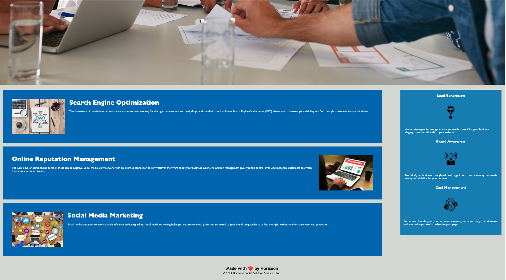

## Code Refactor Assignment

The purpose of this assignment is to refactor the starter code for a digital marketing company called Horiseon, and add to add accessibility alt tags to images, in order to meet accessibility standards, which will optimize the site for search engines. Additionally, it involved updating and organizing the semantics of the starter code so that it follows a logical path, and meets industry standards. 

## Completed Assignment

This image shows the completed assignment's appearance, and functionality:

## Link to Deployed Site

https://knolan18.github.io/1-code-refactor-assignment/

